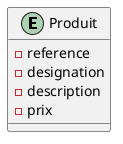

# Architecture hexagonale -  Gestion de produit

## Prérequis

- Docker 
- Java 17

### Execution

### 1. Lancement de l'application

En utilisant docker 
 ```bash
docker-compose build
docker-compose up -d
```
ou en local , par contre vous devriez avoir une bd - PostgreSQL 

#### Installation pgAdmin : 

```bash
docker run --name pgadmin -e "PGADMIN_DEFAULT_EMAIL=pg@mail.com" -e "PGADMIN_DEFAULT_PASSWORD=pgadmin" -p 5050:80 -d dpage/pgadmin4
```
### 2. Analyse de 'dependency-maven' 
 ```bash
 mvn verify -P check-maven-dependency -DskipTests
```
  
### Source  Documentation

- [Blog-eleven-labs](https://blog.eleven-labs.com/fr/architecture-hexagonale/)
- [Scalastic-hexagonal](https://scalastic.io/hexagonal-architecture/)
- [Use docker for postgres](https://www.baeldung.com/ops/postgresql-docker-setup)
- [Use docker with bridge](https://dev.to/steadylearner/how-to-set-up-postgresql-and-pgadmin-with-docker-51h)
- [Hexago-benefits](https://galadrim.fr/blog/architecture-hexagonale-principes-benefices-et-conception)

### Plan UML 

### Swagger URL 
- [URI for swagger](http://localhost:8080/swagger-ui/index.html)
